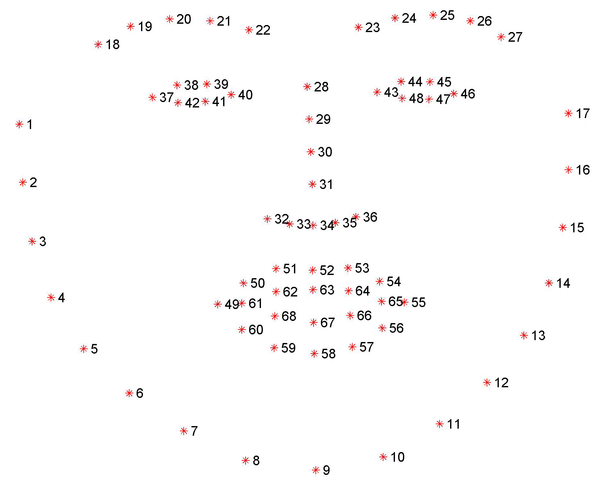

# Facial Keypoint Detection

FKD (Facial Keypoint Detection) is a Pytorch project submitted as part of the Udacity Computer Vision Nanodegree. 

Facial keypoints are described as coordinates on the image. A single face contains **68 keypoints, with coordinates (x, y)**.  These keypoints mark important areas of the face: the eyes, corners of the mouth, the nose, etc. These keypoints are relevant for a variety of tasks, such as face filters, emotion recognition, pose recognition, and so on.

The aim of this project is to detect the keypoints of every face across the image. At first the CNN will identify keypoints in normalized images, containing only one face with (roughly) the same crop and scale. Finally, this will be extended to work with any image.

## Description

This project is made up of several Jupyter Notebooks that tackle the Facial Keypoint detection task in Python and Pytorch. 

1. Load and Visualize Data.ipynb
This notebook describes the first steps to load and visualize the images and the keypoints on that image. This set of image data has been extracted from the [YouTube Faces Dataset](https://www.cs.tau.ac.il/~wolf/ytfaces/), which includes faces of people in YouTube videos. This notebook contains a more detailed description of the dataset. The dataset is loaded together with the transformations that pre-process the data.
	1. Normalization of the image: convert a color image to grayscale and normalize the color range [0,1]
	2. Rescaling of the object: rescale the image and the keypoints in a sample to a given size (250)
	3. Random Cropping the the image in a sample (224x224)
	4. Convert the numpy images to torch tensors: swap color axis (from H x W x C to C x H x W) and convert to torch tensor
Then, these transforms are applied to the dataset. A utility function to display keypoints and their relative image is created.

The description of the keypoints can be found in the following picture.

2. Define the Network Architecture.ipynb
The network is defined in `models.py`. The dataset is loaded from [this website]( https://s3.amazonaws.com/video.udacity-data.com/topher/2018/May/5aea1b91_train-test-data/train-test-data.zip). Then, the transforms are applied to the data and it is divided in batches. The training iterations are defined. The number of epochs is defined and the network is trained. Finally, it is tested on some sample outputs. Some utility functions are defined:
	1. Save a model in Pytorch
	2. Load a model in Pytorch
	3. Visualize some of the filters
	4. Filter an image to produce to see the effect of convolutional filters

3. Facial Keypoint Detection, Complete Pipeline.ipynb
This notebook combines a Haar Cascade face detector with the best saved model to create a facial keypoint detection system that can predict the keypoints on *any* face in an image! Starting from an arbitrary image, it is passed to the `detector_architectures/haarcascade_frontalface_default.xml`. This procedure will output the regions of the detected faces in the image. Then, the image is cropped around the detected faces, and transformed according to the list of transforms defined in in Notebook 2. These images are fed to the neural network and the keypoints are predicted.

Additionally there is a smile detector function. It starts from a Haar Cascade Detector and shows the instances of smiles in the image. 

4. Fun with Keypoints.ipynb
Keypoint Detection can be used to apply filters on a person's face. For example, a facial filter will be adding sunglasses to someone's face. Sunglasses, and every other filter must be described by 4 dimensions. We have RGB colors and alpha, information about **transparency**. If alpha is 0, the pixel is transparent, otherwise it will be (to some degree) visible. The aim of this notebook is to match the regions of the eyes with the image of the sunglasses, except for the transparent pixels. 

## Contributing
Pull requests are welcome. For major changes, please open an issue first to discuss what you would like to change.

## License
[MIT](https://choosealicense.com/licenses/mit/)
